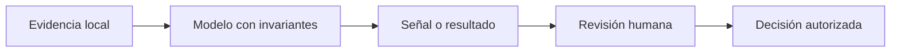

# Alcance y modelo de evidencia

**Estado: draft**

## Concepto

Un sistema de IA combina representaciones, reglas de producto, fuentes de
datos y, con frecuencia, salidas probabilísticas. La ingeniería empieza al
separar lo que el sistema **observó**, lo que **infirió** y lo que una persona
debe **decidir**. Este curso usa modelos locales y deterministas para que cada
contrato sea inspeccionable.

## Problema

Una demostración puede parecer convincente aunque no tenga datos comparables,
procedencia o límite de operación. Si se omite esa evidencia, un score de
similitud se vuelve una afirmación de verdad, una herramienta recibe permisos
implícitos y una evaluación aislada se confunde con calidad en producción.

## Alternativas y decisión

Podríamos iniciar conectando un proveedor de modelos. Eso ocultaría costos,
versiones, red, credenciales y no determinismo. También podríamos usar un
simulador que siempre responde bien; sería reproducible, pero no enseñaría las
fronteras reales. Elegimos modelos mínimos locales: muestran los invariantes y
dejan explícito qué falta antes de una integración de producción.

## Invariantes

- Una señal no es una decisión ni una garantía de verdad.
- Todo fragmento recuperado conserva su procedencia.
- Toda herramienta parte sin capacidades; se habilita por contrato explícito.
- Los casos de evaluación son reproducibles y sus límites se reportan.
- El crate no usa red, claves, datos personales, `unsafe` ni proveedores.

## Ejemplo

Un buscador local puede devolver el documento con mayor similitud. Esa salida
solo afirma que dos vectores están próximos bajo una métrica; no prueba que el
documento sea actual, suficiente o adecuado para tomar una acción. Por eso las
unidades posteriores conservan fuente, presupuesto y una política de revisión.

## Ejercicios

1. Clasifica como evidencia, inferencia o decisión: una puntuación de 0.91,
   una lista de fuentes, aprobar un reembolso.
2. Describe una consecuencia de perder la procedencia de un fragmento RAG.

## Soluciones

1. La puntuación y la lista son evidencia o señales; aprobar el reembolso es
   una decisión que requiere una política y una persona responsable.
2. Ya no se puede verificar actualidad, autoridad, licencia ni contexto del
   texto que influyó en la respuesta.

## Referencias

- RFC-0001 §2, §10, §13-§17 y §20.
- NIST, *AI Risk Management Framework*.
- OWASP, *Top 10 for Large Language Model Applications*.
