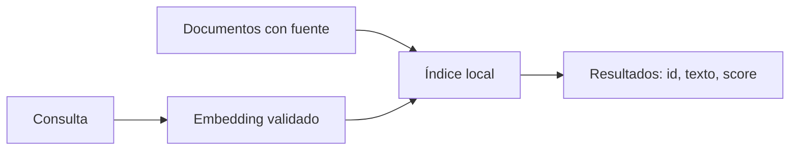

# Representaciones y recuperación

**Estado: draft**

## Concepto

Un embedding es una representación numérica de un objeto. La recuperación no
"entiende" una fuente: compara representaciones bajo una métrica y ordena los
candidatos. En el crate, `Embedding`, `cosine_similarity` e `InMemoryIndex`
hacen visible ese contrato sin depender de un proveedor.

## Problema

Una consulta no puede revisar todos los documentos manualmente. Se necesita
una señal que reduzca candidatos, pero sin perder identidad, texto ni
procedencia. Devolver solo un score impide explicar qué evidencia se usó.

## Alternativas y decisión

La distancia euclidiana favorece proximidad absoluta; el producto punto puede
favorecer magnitudes grandes. La similitud coseno compara orientación y resulta
útil para explicar el ejemplo. Elegimos un índice lineal en memoria porque su
costo y orden son visibles. No pretende reemplazar ANN, HNSW, filtros ni una
base vectorial de producción.



## Invariantes

- Los vectores no están vacíos y sus componentes son finitos.
- Una comparación exige la misma dimensión.
- Un documento no puede duplicar su identificador.
- Un empate se resuelve por identificador, no por orden accidental.
- La recuperación mantiene el texto y el id que permiten revisar la fuente.

## Ejemplo

```rust
use rust_ai_engineering::retrieval::{Embedding, InMemoryIndex, IndexedDocument};

let mut index = InMemoryIndex::new(2);
index.insert(IndexedDocument::new(
    "rust",
    "Rust protege invariantes en compilación.",
    Embedding::new(vec![1.0, 0.0])?,
))?;
let results = index.search(&Embedding::new(vec![1.0, 0.0])?, 1)?;
assert_eq!(results[0].id, "rust");
# Ok::<(), Box<dyn std::error::Error>>(())
```

El ejemplo no demuestra relevancia semántica universal: solo verifica el
contrato de representación y orden local.

## Costos y límites

La búsqueda lineal cuesta O(n * d), con `n` documentos y dimensión `d`. Es
buena para estudiar invariantes, no para colecciones grandes. La métrica puede
devolver un resultado alto aun cuando la fuente esté desactualizada o no
responda toda la pregunta.

## Ejercicios

1. Añade una prueba para un vector de magnitud cero.
2. Explica por qué un score alto no autoriza ejecutar una herramienta.

## Soluciones

1. La prueba debe esperar `SimilarityError::ZeroMagnitude`; dividir entre cero
   oculta un contrato roto.
2. El score habla de una métrica de representación, no de permisos, intención
   ni impacto de una acción.

## Referencias

- RFC-0001 §10, §13 y §14.
- Manning, Raghavan y Schütze, *Introduction to Information Retrieval*.
