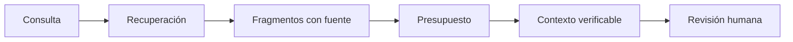

# RAG y construcción de contexto

**Estado: draft**

## Concepto

RAG separa recuperar evidencia de construir el contexto que recibirá un modelo.
La segunda etapa decide cuánto texto cabe, qué fuentes se preservan y qué se
descarta. `ContextBuilder` muestra esa decisión de manera determinista.

## Problema

Un resultado recuperado puede ser relevante pero no caber, venir sin fuente o
mezclarse con instrucciones no confiables. Concatenar todo destruye el
presupuesto y vuelve opaca la respuesta.

## Alternativas y decisión

Truncar caracteres a mitad de un fragmento puede alterar significado y perder
citas. Elegimos incluir fragmentos completos en orden, hasta el presupuesto,
y conservar una lista de fuentes. En producción se pueden aplicar reranking,
diversidad y tokenización real, siempre con el mismo contrato de procedencia.



## Invariantes y límites

- Ningún fragmento sin fuente entra al contexto.
- Ningún fragmento vacío entra al contexto.
- El presupuesto se respeta sin truncar texto.
- Una fuente incluida no implica que responda la pregunta completa.

## Ejemplo

```rust
use rust_ai_engineering::context::{ContextBuilder, ContextFragment};

let context = ContextBuilder::new(30)?.assemble([
    ContextFragment::new("rfc-0001", "La evidencia conserva fuente."),
])?;
assert_eq!(context.sources, vec!["rfc-0001"]);
# Ok::<(), Box<dyn std::error::Error>>(())
```

## Ejercicios

1. ¿Por qué un presupuesto de caracteres no equivale a un presupuesto de tokens?
2. Diseña una política para priorizar fuentes recientes sin ocultar las antiguas.

## Soluciones

1. Los tokenizadores dividen texto de otra forma; el modelo local usa
   caracteres solo para hacer el límite observable.
2. Conserva fecha y autoridad en la procedencia, ordena explícitamente y
   registra la razón de descarte.

## Referencias

- RFC-0001 §10 y §14.
- Lewis et al., *Retrieval-Augmented Generation for Knowledge-Intensive NLP Tasks*.
