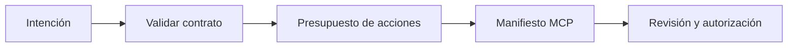

# Herramientas, agentes y MCP

**Estado: draft**

## Concepto

Una herramienta es una capacidad con contrato, no una instrucción libre. Un
agente coordina pasos bajo un presupuesto. MCP permite describir servidores y
capacidades, pero no elimina la necesidad de validar autorización, datos y
efectos.

## Problema

Permitir que una salida textual elija una herramienta o invente argumentos
convierte ambigüedad en permisos. Un bucle sin presupuesto puede insistir,
ampliar impacto y producir trazabilidad incompleta.

## Alternativas y decisión

Para acciones simples, una función determinista es preferible a un agente.
Cuando se necesita coordinación, el crate usa un registro de herramientas, una
lista permitida de argumentos y un presupuesto de acciones. El manifiesto MCP
solo declara capacidades: no abre red ni ejecuta llamadas.



## Invariantes

- Una solicitud no declara capacidades nuevas.
- Validar una herramienta no la ejecuta.
- Un agente termina al agotar su presupuesto.
- Un manifiesto enumera capacidades, no otorga confianza automática.

## Ejemplo

```rust
use rust_ai_engineering::orchestration::McpManifest;

let manifest = McpManifest::new("local", ["buscar"])?;
assert!(manifest.allows("buscar"));
assert!(!manifest.allows("borrar"));
# Ok::<(), rust_ai_engineering::orchestration::AgentError>(())
```

## Ejercicios

1. Describe una operación que deba seguir siendo una función, no un agente.
2. ¿Qué debe registrar una acción antes de ejecutarse?

## Soluciones

1. Formatear una fecha o validar un identificador: tienen contrato completo y
   no requieren planificación.
2. Herramienta, argumentos validados, fuente de la intención, presupuesto y
   responsable que autorizó el efecto.

## Referencias

- RFC-0001 §10, §14 y §20.
- Model Context Protocol, especificación conceptual.
