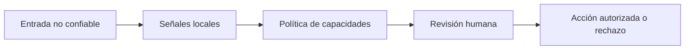

# Seguridad y límites de confianza

**Estado: draft**

## Concepto

El texto recuperado, las solicitudes de usuario y las salidas de modelos son
datos no confiables. La seguridad de IA aplica el principio de menor privilegio:
detectar señales, restringir capacidades y revisar consecuencias.

## Problema

Una instrucción incrustada puede intentar cambiar el objetivo, revelar contexto
interno o pedir una acción fuera de contrato. No existe una cadena de palabras
que resuelva por sí sola ese riesgo; las heurísticas fallan en ambos sentidos.

## Decisión

`inspect_instruction` solo entrega señales explicables y pide revisión. La
defensa real combina separación de datos e instrucciones, allowlists de
herramientas, presupuestos, sandboxing, registros y autorización humana.

## Límites

- Ausencia de señal no significa entrada segura.
- Presencia de señal no prueba intención maliciosa.
- Un agente no recibe autoridad por interpretar una instrucción.
- El sandbox reduce alcance; no sustituye auditoría ni diseño de permisos.

## Ejercicios

1. Propón dos capas que acompañen a una heurística de prompt injection.
2. Explica por qué recuperar una fuente confiable no vuelve confiable toda su
   instrucción incrustada.

## Soluciones

1. Allowlist de herramientas y confirmación humana antes de efectos externos.
2. La fuente puede contener texto citado, desactualizado o fuera del propósito
   actual; se evalúa contexto y capacidad por separado.

## Referencias

- RFC-0001 §10, §13 y §20.
- OWASP, *Top 10 for Large Language Model Applications*.
