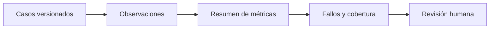

# Evaluación y cierre

**Estado: draft**

## Concepto

Evaluar es comparar resultados observados contra expectativas explícitas. Un
arnés reproducible convierte afirmaciones vagas en casos que pueden fallar,
pero una métrica resume una muestra: no certifica utilidad, seguridad ni
calidad futura.

## Problema

Sin casos versionados, una mejora local puede degradar recuperación, seguridad
o trazabilidad sin que nadie lo note. Con una sola tasa agregada, también se
pueden esconder fallos críticos de una clase poco frecuente.

## Decisión

`evaluate` reporta total, pases, fallos y tasa. Los casos conservan id,
expectativa y observación. La revisión debe mirar los fallos, cobertura por
riesgo, representatividad de datos y cambios de contrato.

## Límites

- Una tasa alta puede omitir un fallo de seguridad importante.
- Casos sintéticos no representan por sí solos a usuarios reales.
- Cambiar el conjunto de prueba cambia el significado de la métrica.
- La evaluación continua requiere versiones, umbrales y responsables.

## Ejercicios

1. Diseña dos casos para comprobar que el contexto conserva procedencia.
2. ¿Qué información falta si solo recibes `pass_rate = 0.95`?

## Soluciones

1. Un fragmento con fuente debe conservarla; uno sin fuente debe rechazarse.
2. Tamaño de muestra, distribución de riesgos, fallos concretos, versiones y
   criterio de aceptación.

## Referencias

- RFC-0001 §2, §10, §14 y §20.
- NIST, *AI Risk Management Framework*.
